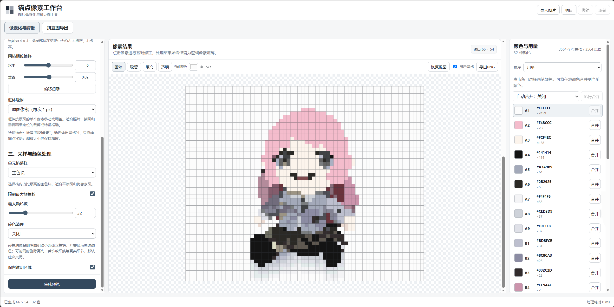
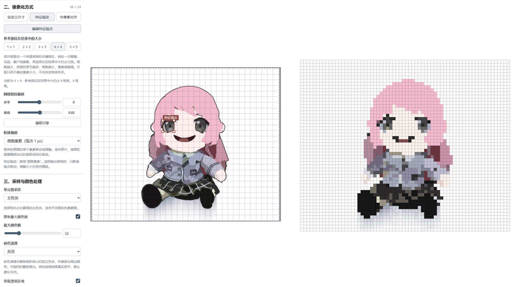
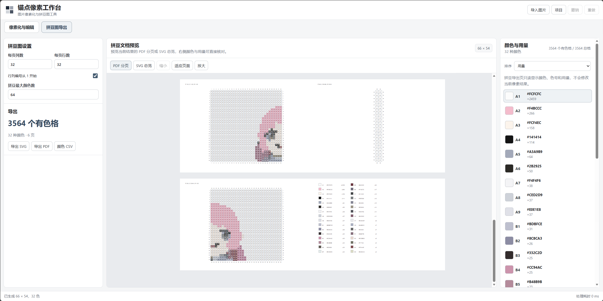
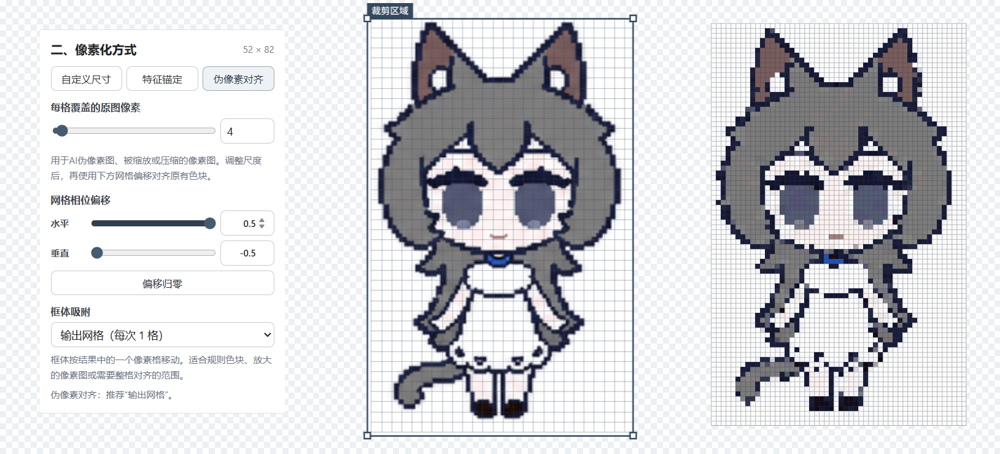

# 锚点像素工作台 / Pixel Anchor Studio

一个本地优先的轻量图片像素化与拼豆图制作工具。

Pixel Anchor Studio 面向普通图片、插画、二次元图片、AI 生成的伪像素图以及已经具有像素块结构的图片，提供从裁剪、像素尺度控制、颜色精简、局部修正，到 PNG、SVG、PDF 和 CSV 导出的完整工作流。

图片处理默认只在当前设备中完成，不需要上传到服务器。

> 当前桌面版本：v0.5.1  
> 支持平台：Windows 10 / 11 x64  
> 同时保留浏览器版本与 Windows 桌面版本。

---

## 界面预览








---

# 功能

## 图片像素化

支持最大 `256 × 256` 的逻辑像素结果，并提供三种尺度控制方式。

### 自定义尺寸

直接指定输出长边。

适合普通照片、风景、物品、插画和大多数需要快速像素化的图片。

### 特征锚定

在原图中用正方形锚点标记一个关键特征，再指定该特征希望在最终结果中占多少格。

适合人物眼睛、花朵、窗户、小型图案等需要保留局部识别度的图片。

锚点使用统一正方形网格。

### 伪像素对齐

针对已经存在像素块结构的图片重新对齐网格尺度与相位。

适合被放大的旧像素图、AI 生成的伪像素图以及需要重新整理到规则网格的素材。

建议多次尝试不同的`每格覆盖的原图像素`与`网格相位偏移`参数以便达到更好的效果

若局部不满意可以使用内置简易像素结果绘制进行基础修正



---

## 裁剪与视图

支持：

- 完整原图；
- 居中正方形；
- 自由裁剪；
- 输出网格吸附；
- 网格相位偏移；
- 原图网格显示。

原图与像素结果均支持：

- `Ctrl / Command + 滚轮`：缩放；
- 空格 + 左键：自由平移；
- 中键：自由平移；
- 双击空白区域：恢复视图；
- 普通滚轮：滚动中央页面。

拼豆文档使用更适合阅读的普通页面滚动与中心缩放。

---

## 颜色处理

可以：

- 限制颜色数量；
- 按用量排序；
- 按色环排序；
- 合并相近颜色；
- 清理少量孤立杂色；
- 手动合并颜色；
- 保留透明区域。

逻辑像素矩阵始终是编辑、统计和导出的统一数据源。

---

## 像素编辑

像素结果支持：

- 画笔；
- 吸管；
- 填充；
- 透明工具；
- 撤销；
- 重做；
- 显示/隐藏网格。

连续编辑以一次笔画作为历史事务，避免逐像素产生大量撤销记录。

---

## 导出

### PNG

支持 `1×`、`2×`、`4×`、`8×` 以及自定义 `1–32×` 整数倍。

### 拼豆 SVG

适合完整图案总览、高质量缩放、后续矢量编辑和打印前检查。

### 拼豆 PDF

提供 A4 横向分页，保留行列定位、网格、色号、HEX、数量和页码。

PDF 使用 ASCII 定位文本，避免不同系统字体造成中文乱码。

### 颜色 CSV

导出颜色统计，方便进一步整理、购买材料或导入表格软件。

---

# 快速使用

1. 导入图片；
2. 选择裁剪范围；
3. 选择自定义尺寸、特征锚定或伪像素对齐；
4. 调整颜色处理设置；
5. 生成像素结果；
6. 使用画笔、吸管、填充或颜色合并进行必要修正；
7. 导出 PNG；
8. 需要拼豆施工图时进入拼豆工作区；
9. 检查并导出 SVG、PDF 或 CSV；
10. 需要保留完整工作状态时保存项目。

---

# 文件导入

支持文件拖放，可将资源管理器中的图片直接拖到工作区域，释放即可导入。

- 单张图片：直接导入；
- 单个项目文件：直接打开；
- 多张图片：处理第一张支持图片，并提示其余文件未处理；
- 项目与其他文件混合：要求项目单独拖入；
- 多个项目：不自动选择；
- 文件夹：暂不直接导入；
- 不支持的文件：显示非阻塞错误提示。

导入新图片、打开其他项目、拖入替换文件、清空当前内容或退出时，如果当前内容存在未保存修改，会先询问是否保存。

---

# Windows 桌面版

目前仅提供两种 Windows x64 发行形式。

## 安装版

- 当前用户安装；
- 可以修改应用安装位置；
- 可以修改应用数据位置；
- 默认应用数据目录：

```text
%LOCALAPPDATA%\PixelAnchorStudio\data
```

- 可以将数据放在安装目录的 `data` 子目录；
- 默认创建开始菜单快捷方式；
- 桌面快捷方式默认不创建，可在安装时勾选；
- 卸载时默认清理经过所有权确认的应用设置、缓存和恢复数据；
- 不递归删除安装目录中的未知文件。

如果用户将项目、PNG、PDF 等个人文件放在安装目录中，卸载器会保留这些未知文件，并保留非空目录。

## 便携版

目录名称：

```text
PixelAnchorStudio-Portable
```

应用自身数据存放在：

```text
PixelAnchorStudio-Portable\data
```

移动整个目录即可迁移应用设置和缓存。

删除整个便携目录会同时删除其中所有内容，包括用户自行保存到该目录中的项目或导出结果。删除前请先备份需要保留的文件。

---

# WebView2

Windows 桌面版使用 Microsoft Edge WebView2 Runtime 显示界面。

大多数 Windows 10/11 系统已经包含 WebView2。

如果首次启动时未检测到 Runtime：

- 应用会在创建主窗口之前给出原生提示；
- 可以运行随包提供的微软官方 Bootstrapper；
- 可以打开微软官方下载页面；
- WebView2 安装完成后再启动应用。

WebView2 已经存在时，核心图片处理、项目读写和导出功能均可断网使用。

卸载 Pixel Anchor Studio 不会卸载系统共享的 WebView2 Runtime。

---

# SmartScreen 与文件校验

当前测试阶段的 Windows 桌面包尚未进行代码签名，因此 Microsoft Defender SmartScreen 可能显示“Windows 已保护你的电脑”。

本项目目前完全免费，任何需要花钱购买均为盗版，请只从本项目官方 GitHub 仓库获取文件，并核对随包提供的 `SHA256SUMS.txt`。

PowerShell 校验示例：

```powershell
Get-FileHash .\PixelAnchorStudio-0.5.1-Setup.exe -Algorithm SHA256
Get-FileHash .\PixelAnchorStudio-0.5.1-Portable.zip -Algorithm SHA256
```

确认来源和 SHA-256 无误后，可在 SmartScreen 中点击“更多信息”，检查应用名称，再点击“仍要运行”。不要关闭 SmartScreen。

---

# 当前限制

目前没有：

- 自动眼睛或人脸识别；
- Perler、Hama、Artkal 等厂商固定色板；
- 批量图片处理；
- 云端同步；
- 自动更新；
- 完整中英双语 UI。

大型拼豆施工图包含较多网格和文字，生成与查看可能需要更多时间。

大尺寸原图保存到项目文件时也可能需要更高的瞬时内存，重要项目建议同时保留原图和最终导出结果。

---

# 开发者说明

## 技术栈

前端：

- Vue 3
- TypeScript
- Vite
- Pinia

图像处理：

- Canvas 2D
- Web Worker
- ImageBitmap
- TypedArray

文档导出：

- jsPDF
- SVG
- CSV

桌面：

- Tauri 2
- Rust
- Microsoft Edge WebView2
- NSIS

测试：

- Vitest
- Playwright

CI/CD：

- GitHub Actions

---

## 设计原则

- 图片默认只在本地处理；
- 逻辑像素矩阵是编辑和导出的唯一结果源；
- 核心采样和颜色算法保持确定性；
- 新算法需要提供可复现测试；
- 组件不重复实现量化、导出或处理算法；
- 最大输出统一受 `MAX_OUTPUT_SIZE` 约束；
- 不直接加入来源或许可证不明确的厂商色板；
- Web 版和桌面版尽可能复用领域逻辑，仅隔离平台文件与系统能力。

---

## 主要目录

```text
pixel-anchor-studio/
├─ .github/
│  └─ workflows/         GitHub Actions
├─ public/               静态资源
├─ scripts/              桌面打包、版本同步、校验和等脚本
├─ src/                  Vue / TypeScript 主应用
├─ src-tauri/            Tauri / Rust / NSIS 桌面外壳
├─ tests/                单元、集成、端到端与回归测试
├─ CHANGELOG.md
├─ CONTRIBUTING.md
├─ LICENSE
├─ package.json
└─ vite.config.ts
```

`src` 内部主要按以下职责组织：

```text
components/       UI组件
composables/      视图、生命周期和交互组合逻辑
core/             网格、采样、颜色、导出等核心纯逻辑
domain/           项目、文件入口、编辑等领域层
platform/         Web与Desktop平台能力隔离
stores/           Pinia状态协调
workers/          后台图像处理
```

`src-tauri` 负责：

```text
应用启动
WebView2检测
安装/便携模式数据目录
系统文件能力
原生拖放
窗口状态
单实例
NSIS安装与安全卸载
```

---

## Web 开发环境

建议使用 Node.js 22。

安装依赖：

```bash
npm ci
```

启动开发：

```bash
npm run dev
```

生产 Web 构建：

```bash
npm run build
```

---

## 测试

```bash
npm run typecheck
npm run test
npm run check
npm run test:e2e
npm run test:bench
```

其中 `npm run check` 包含：

```text
typecheck
unit test
production build
```

---

## 桌面开发

Windows 桌面开发需要 Node.js 22、Rust stable 和 x64 MSVC 构建环境。

```bash
npm run desktop:dev
npm run desktop:build
npm run desktop:webview2
npm run desktop:portable
npm run desktop:installer
npm run desktop:release
```

Windows 发行包建议通过仓库提供 GitHub Actions Windows Runner 进行按需构建。

---

## GitHub Actions

### CI

`.github/workflows/ci.yml`

触发：

```text
push
pull_request
```

执行：

- `npm run check`
- Playwright E2E

CI 不生成或上传 Windows 安装版和便携版。

### Desktop Build

`.github/workflows/desktop-build.yml`

只支持手动 `workflow_dispatch`。

它会在 GitHub 托管的 Windows Runner 上运行测试、准备 WebView2 Bootstrapper、构建便携版和 NSIS 安装版、生成 SHA-256，并上传 Artifact。

Artifact 默认保留 14 天，不会自动创建 GitHub Release。

---

## 提交前检查

至少执行：

```bash
npm run typecheck
npm run test
npm run build
```

影响主要用户流程时，同时运行：

```bash
npm run test:e2e
```

功能变化需要同步更新 `CHANGELOG.md`。

---

## 贡献

提交前请阅读 [CONTRIBUTING.md](CONTRIBUTING.md)。

建议：

- 一个提交解决一个明确问题；
- 不把实验算法直接并入默认路径；
- UI 行为变化补充端到端或组件测试；
- 处理输出变化补充确定性回归样例；
- 平台专用逻辑留在 `platform` 或 `src-tauri` 边界。

---

## 更新日志

完整版本变化见 [CHANGELOG.md](CHANGELOG.md)。

---

## 许可证

本项目采用 MIT License。

完整许可证见 [LICENSE](LICENSE)。

Copyright (c) 2026 EachYoungX
